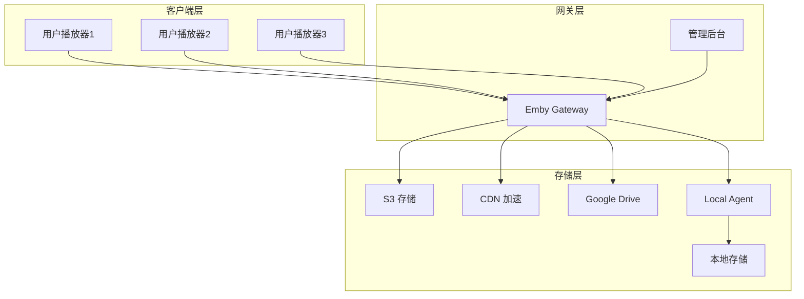

# 项目介绍与架构说明

## 1. 项目概述

Emby Gateway 是一个功能强大的 Emby 播放网关，专为解决 Emby 媒体服务器的存储分发、高可用和统一管理问题而设计。它能够智能地将播放请求重定向到不同的后端存储（如 S3、CDN、Google Drive 或本地存储），实现流量的智能分发和故障自动切换。

### 核心价值

- **存储灵活扩展**：支持多种存储后端，包括对象存储、CDN、Google Drive 和本地存储
- **高可用性**：通过主备后端配置，实现故障自动切换，提高服务稳定性
- **智能路由**：基于路径规则的请求分发，优化存储使用成本
- **统一管理**：提供直观的管理界面，集中配置所有后端和路由规则
- **可观测性**：完善的日志和统计功能，便于运维监控和故障排查

## 2. 系统架构

### 整体架构

Emby Gateway 采用分层架构设计，核心组件关系如下图：

> 图源（可编辑）：`docs/assets/diagrams/01-arch-overview.mmd`

### 核心组件说明

#### 1. Emby Source 入口

- **功能**：接收来自 Emby 客户端的播放请求
- **配置**：监听端口、上游 Emby 地址等
- **作用**：作为整个网关的入口点，处理所有客户端请求

#### 2. 路由规则匹配

- **功能**：根据配置的规则匹配请求路径
- **配置**：路径前缀、正则表达式等匹配规则
- **作用**：决定请求应该使用哪个资源池

#### 3. 路径映射

- **功能**：将 Emby 路径映射到后端存储路径
- **配置**：源路径和目标路径的映射关系
- **作用**：解决 Emby 路径与后端存储路径不一致的问题

#### 4. 资源池

- **功能**：管理后端存储的主备关系
- **配置**：主后端、备后端列表
- **作用**：实现后端故障自动切换，提高可用性

#### 5. 后端存储

- **功能**：实际存储媒体文件的位置
- **类型**：S3、CDN、Google Drive、本地存储等
- **作用**：提供媒体文件的实际存储和访问

#### 6. 管理后台

- **功能**：配置管理、监控查看
- **访问**：Web 界面
- **作用**：集中管理所有配置项，查看系统状态

#### 7. 配置数据库

- **功能**：存储所有配置信息
- **类型**：SQLite 或 PostgreSQL
- **作用**：持久化配置，支持配置的修改和加载

#### 8. 请求日志与统计

- **功能**：记录请求信息和统计数据
- **内容**：访问量、状态码、响应时间等
- **作用**：用于运维监控和故障排查

## 3. 工作流程

### 播放请求处理流程

> 图源（可编辑）：`docs/assets/diagrams/02-playback-sequence.mmd`

1. **请求接收**：用户通过 Emby 客户端发起播放请求，请求首先到达 Emby Source 入口
2. **路由匹配**：系统根据配置的路由规则，匹配请求路径
3. **路径映射**：如果配置了路径映射，系统会将 Emby 路径转换为后端存储路径
4. **资源池选择**：根据路由规则匹配结果，选择对应的资源池
5. **后端选择**：优先选择资源池中的主后端
6. **请求转发**：将请求转发到选中的后端存储
7. **故障切换**：如果主后端失败，系统会自动尝试备后端
8. **响应返回**：后端存储返回媒体数据，经过网关返回给客户端
9. **日志记录**：系统记录请求处理过程和结果

### 配置管理流程

1. **配置修改**：管理员通过管理后台修改配置
2. **配置存储**：配置被存储到配置数据库
3. **配置加载**：系统实时或定期加载最新配置
4. **配置生效**：新配置立即或在下次请求时生效

## 4. 部署拓扑

### 典型部署架构

### 部署模式

1. **单节点部署**：适用于小规模使用场景，所有组件部署在同一台服务器
2. **多节点部署**：适用于大规模使用场景，网关和存储分离部署
3. **混合部署**：结合云存储和本地存储，优化成本和性能

## 5. 技术栈

- **后端**：Go 语言
- **前端**：Vue.js
- **数据库**：SQLite / PostgreSQL
- **存储**：S3、CDN、Google Drive、本地存储
- **部署**：Docker / 二进制

## 6. 系统特点

### 6.1 灵活性

- 支持多种存储后端，满足不同场景需求
- 可自定义路由规则，实现精细化的请求分发
- 支持路径映射，解决路径不一致问题

### 6.2 高可用性

- 主备后端配置，实现故障自动切换
- 支持多资源池，分散风险

### 6.3 可扩展性

- 模块化设计，易于添加新的后端类型
- 支持水平扩展，应对高并发场景

### 6.4 可管理性

- 直观的 Web 管理界面
- 完善的配置文档
- 详细的日志和统计信息

## 7. 应用场景

### 7.1 个人媒体服务器

- **需求**：稳定的媒体访问，灵活的存储选择
- **方案**：单节点部署，结合本地存储和云存储

### 7.2 小型媒体服务

- **需求**：一定的并发能力，高可用性
- **方案**：单节点部署，配置主备后端

### 7.3 大型媒体服务

- **需求**：高并发，高可用，成本优化
- **方案**：多节点部署，结合 CDN 加速，按路径分流

## 8. 架构演进

Emby Gateway 采用模块化设计，便于后续功能扩展和架构演进：

- **存储后端扩展**：可轻松添加新的存储类型
- **路由规则增强**：支持更复杂的匹配逻辑
- **监控系统集成**：可与 Prometheus、Grafana 等监控系统集成
- **自动化运维**：支持配置的版本管理和回滚

通过不断的架构优化和功能增强，Emby Gateway 将为 Emby 媒体服务器提供更加稳定、高效和灵活的存储分发解决方案。
