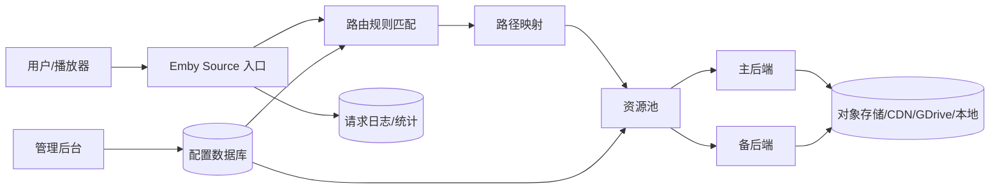

## 架构总览

```mermaid
flowchart LR
    U[用户/播放器] --> S[Emby Source 入口]
    S --> R[路由规则匹配]
    R --> M[路径映射]
    M --> P[资源池]
    P --> B1[主后端]
    P --> B2[备后端]
    B1 --> C[(对象存储/CDN/GDrive/本地)]
    B2 --> C

    A[管理后台] --> CFG[(配置数据库)]
    CFG --> R
    CFG --> P

    S --> L[(请求日志/统计)]
```

架构图源文件：`docs/assets/diagrams/01-arch-overview.mmd`

## 先看这三篇

- 先了解能做什么：`功能总览`
- 新部署用户先读：`快速开始`
- 需要实操配置：`一步步配置指南`
- 看不懂术语时：`术语速查`
