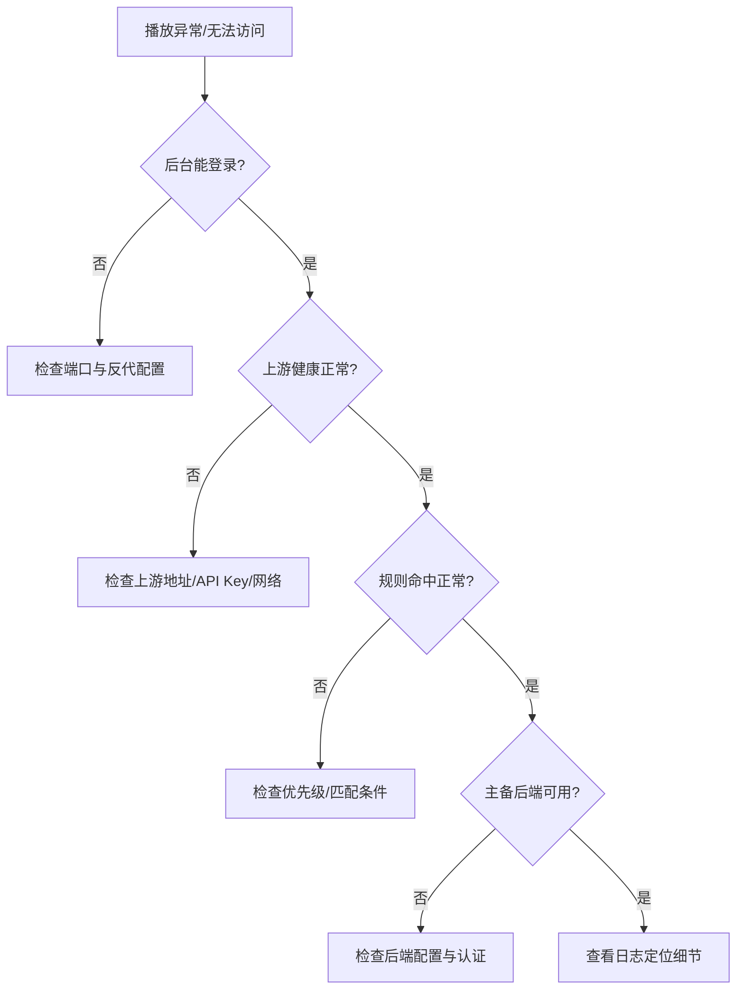

# 故障排查

本文档按“症状 -> 可能原因 -> 排查动作”组织，优先帮助你在生产现场快速止损。

## 0. 建议排查顺序

排障图源文件：`docs/assets/diagrams/05-troubleshooting-flow.mmd`

1. 先看管理端是否可访问（登录页是否正常）
2. 再看上游 Emby 健康（后台健康状态是否正常）
3. 再看请求日志/错误日志（后台日志页是否有报错）
4. 最后定位路由链路（Route -> PathRuleSet -> ResourcePool -> Backend）

## 1. 管理端打不开

可能原因：

- 监听端口不是你以为的值（被数据库配置覆盖）
- 反向代理未转发到正确地址
- 进程未正常启动

排查动作：

- 检查启动参数/环境变量中的 `GATEWAY_ADMIN_HOST`、`GATEWAY_ADMIN_PORT`
- 直接访问：`http://<host>:<port>/ui/index.html`
- 查看后台错误日志是否有启动失败信息

## 2. 播放请求没有发生重定向

可能原因：

- 该请求未命中可拦截路径
- 路由规则未命中或优先级被更高规则抢占
- 路径映射失败且 `require_mapping=true`

排查动作：

- 在后台请求日志中看对应请求状态与路径
- 检查 Route 的 `priority`、`real_path_prefix`、`real_path_regex`
- 检查 PathRuleSet 的 `mappings` 与 `require_mapping` 配置

## 3. 出现 `502 no route matched`

可能原因：

- Source 下没有启用 Route
- 路径匹配条件不覆盖当前请求路径

排查动作：

- 确认 Source `enabled=true` 且 `listen_port>0`
- 确认至少一条 Route `enabled=true`
- 先增加一条低优先级兜底规则验证链路，再逐步收紧匹配条件

## 4. 出现 `502 path_rule_set not found / resource_pool not found`

可能原因：

- Route 引用的 ID 与实际配置不一致
- 配置保存后未生效或被覆盖

排查动作：

- 在管理端核对 Route 引用 ID 与实体 ID 是否完全一致
- 保存后刷新页面，确认配置已正确持久化

## 5. 出现 `502 no backend available`

可能原因：

- 主后端和备后端都不可用
- 后端未启用或初始化失败
- 许可证能力不允许该后端类型

排查动作：

- 在日志中搜索 `[BackendV2] Init Failed`、`[RouterV2] ... 生成直链失败`
- 核对 backend `enabled`、类型配置、认证参数
- 检查许可证状态与功能是否覆盖当前后端类型

## 6. 出现“未授权/登录失效”

可能原因：

- 登录状态已过期
- 浏览器缓存了旧登录状态
- 管理密码最近被修改

排查动作：

1. 退出后台后重新登录
2. 若仍失败，清理浏览器缓存后再登录
3. 核对当前管理密码是否正确

## 7. 出现 `403 license feature missing`

可能原因：

- 当前许可证未启用对应功能（如 `core_redirect`、特定 backend）

排查动作：

- 打开后台授权信息页面，确认授权状态正常
- 核对当前已启用功能与实际配置是否匹配

## 8. 上游 Emby 异常（连通性/鉴权）

症状：

- 健康检查 `ok=false`
- 错误可能为 `upstream.host is empty`、`api_key unauthorized`

排查动作：

- 在后台手动触发对应 Source 的连通性检测
- 核对 `upstream.host/base_path/api_key`
- 确认网关机器到上游 Emby 网络可达

## 9. 现场排查小抄（普通用户版）

1. 先确认“后台可登录”
2. 再确认“上游健康正常”
3. 再确认“路由规则已启用且优先级正确”
4. 再确认“资源池主备后端都可用”
