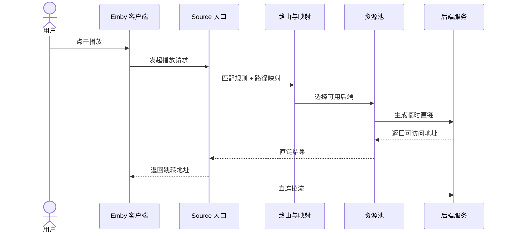
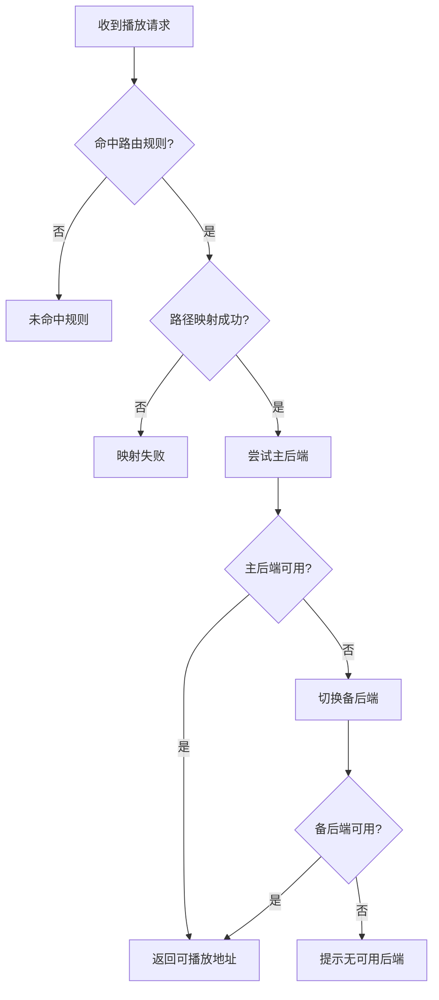

# 路由与故障切换

这篇文档给普通用户看：播放请求为什么会走到某个后端、后端挂了会怎样。

## 1. 用一句话理解

你可以把它想成“分流器”：

- 先判断这条请求属于哪一类
- 再把它送到对应的后端
- 主后端不行时自动换备后端

## 2. 一次播放会发生什么

流程图源文件：`docs/assets/diagrams/02-playback-sequence.mmd`

## 3. 你只要配置这 3 件事

1. `路由规则`：这类请求该走哪条路
2. `路径映射`：路径不一致时怎么转换
3. `资源池`：主后端和备后端是谁

## 4. 主备切换怎么工作

切换图源文件：`docs/assets/diagrams/03-routing-failover.mmd`

## 5. 最常见的 4 个问题

1. 没命中规则：规则太窄或优先级不对
2. 路径不一致：映射没配或方向写反
3. 只有主后端：主后端一挂就失败
4. 规则太多：后加的规则把前面的覆盖了

## 6. 推荐配置习惯（非常实用）

1. 先配一条“兜底规则”，确保都能命中
2. 再按目录逐步细分（电影/剧集/纪录片）
3. 每个资源池都配备后端
4. 每次只改一条规则，改完立即验证播放

## 7. 截图补充位（后续可直接替换）

- 规则列表页：`docs/assets/images/05-route-rule.png`
- 资源池设置页：`docs/assets/images/04-resource-pool.png`
